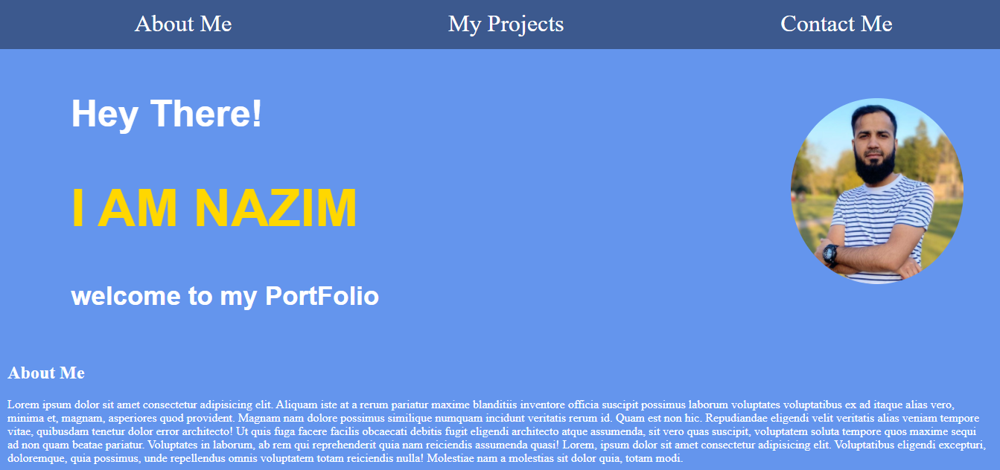
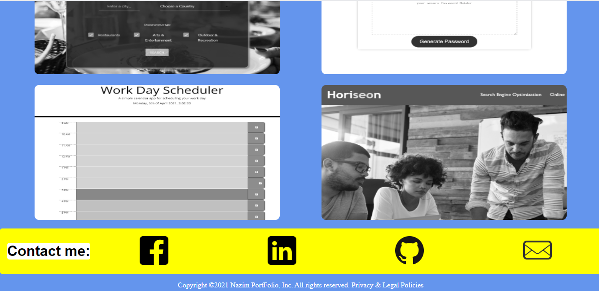

# Portfolio

click[here](https://mrasheed1991.github.io/homework_2_portfolio/)

# Description

- i was given a Task to update my Portfolio.
- in the portfolio i had to create the aboutme,my project and contact me section.
- i had to link all these to my navbar.
- in the contact me section i was asked to provide link to my sociel media accounts.
- in the my project section i had to display my projects and then link them to the project website.
-

# Screenshots

